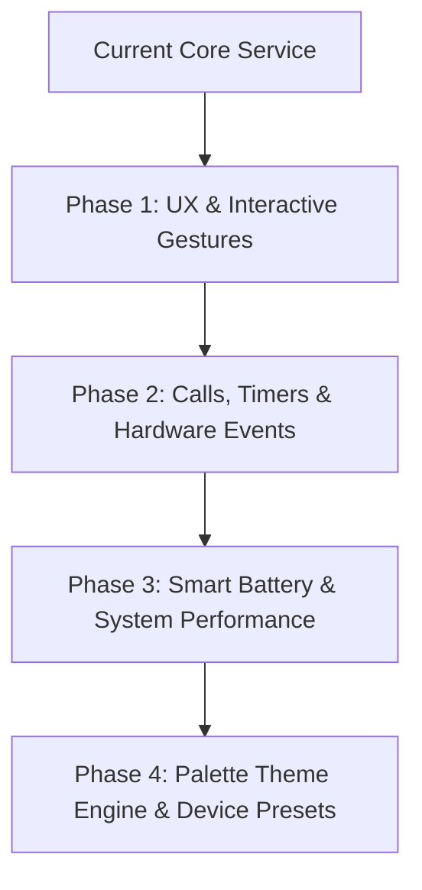

# Phased Enhancement Roadmap for MyIsland (Motorola Edge 60 Pro)

An extensive multi-phase engineering plan to evolve **MyIsland** into a feature-complete, highly polished, and low-power native Android Dynamic Island implementation.

## User Review Required

> [!IMPORTANT]
> **Phase Prioritization**: The proposed roadmap is broken into 4 distinct phases. Please review the proposed phases below and let us know which phase you would like us to begin implementing first!

> [!NOTE]
> All new features will retain backwards compatibility with your current Motorola Edge 60 Pro calibration settings and persistent configuration.

---

## Roadmap Overview & Technical Breakdown

---

## Proposed Phases

### Phase 1: Interactive Gestures, Dual-Island Split & Haptic Feedback

Focuses on fluid touch interactions, multi-tasking island split views, and tactile haptics.

#### [MODIFY] [DynamicIslandView.kt](file:///c:/Users/Deval/Shalkhlan/Desktop/reactApp/MyIsland/app/src/main/java/com/myisland/dynamic/ui/overlay/DynamicIslandView.kt)
- Add gesture detectors:
  - **Swipe Left/Right**: Collapse or temporarily dismiss pill with a smooth spring exit animation.
  - **Long Press**: Open a context action popup menu (quick output device switch, notification mute).
- Implement **Dual-Island Split Architecture**:
  - When two simultaneous background activities occur (e.g. Spotify playing + Active Clock Timer), split into a primary main island + a secondary detached small bubble beside the camera.

#### [NEW] [HapticManager.kt](file:///c:/Users/Deval/Shalkhlan/Desktop/reactApp/MyIsland/app/src/main/java/com/myisland/dynamic/utils/HapticManager.kt)
- Integrate Android `Vibrator` and `VibrationEffect.createPredefined` for subtle haptic clicks when expanding/collapsing the island or pressing media controls.

---

### Phase 2: Live Phone Calls, Active Timers & Bluetooth Headset Banners

Expands system event observers to support native phone calls, timers, and connected Bluetooth accessories.

#### [NEW] [CallSessionManager.kt](file:///c:/Users/Deval/Shalkhlan/Desktop/reactApp/MyIsland/app/src/main/java/com/myisland/dynamic/service/CallSessionManager.kt)
- Intercept incoming and active phone calls via `TelecomManager` / `PhoneStateListener`.
- Display caller contact name, avatar, live call timer, and interactive Mute / End Call buttons in expanded mode.

#### [NEW] [TimerSessionManager.kt](file:///c:/Users/Deval/Shalkhlan/Desktop/reactApp/MyIsland/app/src/main/java/com/myisland/dynamic/service/TimerSessionManager.kt)
- Read active system clock timers & stopwatches to show a live circular countdown progress ring around the island.

#### [NEW] [BluetoothEventReceiver.kt](file:///c:/Users/Deval/Shalkhlan/Desktop/reactApp/MyIsland/app/src/main/java/com/myisland/dynamic/service/BluetoothEventReceiver.kt)
- Listen for Bluetooth headphone / accessory connections (`ACTION_AUDIO_STATE_CHANGED`).
- Show animated connection banner displaying connected device name (e.g., Moto Buds, Galaxy Buds, AirPods) and battery status.

#### [MODIFY] [ExpandedCardContent.kt](file:///c:/Users/Deval/Shalkhlan/Desktop/reactApp/MyIsland/app/src/main/java/com/myisland/dynamic/ui/overlay/ExpandedCardContent.kt)
- Add quick inline reply input field for messaging notifications (WhatsApp, Telegram, SMS).

---

### Phase 3: Smart Battery Throttling & Power Optimization

Ensures zero background battery drain when the device is idle or screen is off.

#### [MODIFY] [IslandOverlayService.kt](file:///c:/Users/Deval/Shalkhlan/Desktop/reactApp/MyIsland/app/src/main/java/com/myisland/dynamic/service/IslandOverlayService.kt)
- Register `ScreenStateReceiver` (`ACTION_SCREEN_OFF` / `ACTION_SCREEN_ON`).
- Automatically suspend Compose rendering pipelines and detach `ComposeView` draw calls when the display turns off, achieving **0.0% standby battery consumption**.

---

### Phase 4: Dynamic Palette Theme Engine & Hardware Presets

Personalizes visual aesthetics based on active app album artwork and device models.

#### [NEW] [PaletteThemeExtractor.kt](file:///c:/Users/Deval/Shalkhlan/Desktop/reactApp/MyIsland/app/src/main/java/com/myisland/dynamic/utils/PaletteThemeExtractor.kt)
- Integrate Android `Palette` library (`androidx.palette:palette-ktx`) to extract vibrant accent colors from active album art or app icons, dynamically tinting audio visualizer bars, progress indicators, and subtle glow shadows.

#### [NEW] [DevicePresets.kt](file:///c:/Users/Deval/Shalkhlan/Desktop/reactApp/MyIsland/app/src/main/java/com/myisland/dynamic/data/DevicePresets.kt)
- Add pre-calibrated alignment profiles for:
  - **Motorola Edge 60 Pro** (Default)
  - **Motorola Edge 50 Ultra / Edge 40 Pro**
  - **Generic Center Punch-Hole Devices**

---

## Verification Plan

### Automated Tests
- Unit test data model transformations (`IslandModelsTest.kt`).
- Unit test state transitions and preferences serialization (`PreferencesManagerTest.kt`).

### Manual Verification
1. Test gesture dismiss & long-press context menu on overlay.
2. Test dual-island split view when playing music while starting a clock timer.
3. Test active phone call controls and Bluetooth headset popup banner.
4. Verify battery consumption metrics using Android Studio Profiler (Energy & CPU consumption when screen is off).
