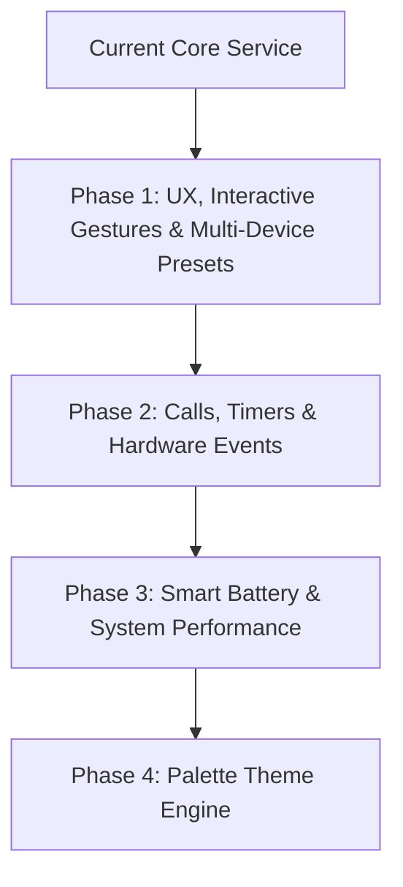

# Phased Enhancement Roadmap for MyIsland (Motorola Edge 60 Pro & Multi-Device Support)

An extensive multi-phase engineering plan to evolve **MyIsland** into a feature-complete, highly polished, and low-power native Android Dynamic Island implementation.

## User Feedback Integrated

> [!NOTE]
> Added pre-calibrated cutout alignment profiles for **Samsung Galaxy S20 FE** and **Samsung Galaxy S23 Plus** alongside Motorola Edge series devices.

---

## Roadmap Overview & Technical Breakdown

---

## Proposed Phases

### Phase 1: Interactive Gestures, Dual-Island Split, Haptics & Device Presets

Focuses on fluid touch interactions, multi-tasking island split views, tactile haptics, and instant device calibration presets.

#### [NEW] [DevicePresets.kt](file:///c:/Users/Deval/Shalkhlan/Desktop/reactApp/MyIsland/app/src/main/java/com/myisland/dynamic/data/DevicePresets.kt)
- Add pre-calibrated alignment profiles:
  1. **Motorola Edge 60 Pro** (Default: Y = 12dp, Width = 190dp, Height = 38dp, Radius = 24dp)
  2. **Samsung Galaxy S20 FE** (Y = 16dp, Width = 180dp, Height = 36dp, Radius = 22dp)
  3. **Samsung Galaxy S23 Plus** (Y = 14dp, Width = 175dp, Height = 35dp, Radius = 24dp)
  4. **Motorola Edge 50 Ultra / Edge 40 Pro** (Y = 12dp, Width = 185dp, Height = 36dp, Radius = 24dp)
  5. **Generic Center Punch-Hole** (Y = 14dp, Width = 180dp, Height = 36dp, Radius = 22dp)

#### [MODIFY] [DynamicIslandView.kt](file:///c:/Users/Deval/Shalkhlan/Desktop/reactApp/MyIsland/app/src/main/java/com/myisland/dynamic/ui/overlay/DynamicIslandView.kt)
- Add gesture detectors:
  - **Swipe Left/Right**: Collapse or temporarily dismiss pill with a smooth spring exit animation.
  - **Long Press**: Open a context action popup menu (quick output device switch, notification mute).
- Implement **Dual-Island Split Architecture**:
  - When two simultaneous background activities occur (e.g. Spotify playing + Active Clock Timer), split into a primary main island + a secondary detached small bubble beside the camera.

#### [NEW] [HapticManager.kt](file:///c:/Users/Deval/Shalkhlan/Desktop/reactApp/MyIsland/app/src/main/java/com/myisland/dynamic/utils/HapticManager.kt)
- Integrate Android `Vibrator` and `VibrationEffect.createPredefined` for subtle haptic clicks when expanding/collapsing the island or pressing media controls.

#### [MODIFY] [SettingsScreens.kt](file:///c:/Users/Deval/Shalkhlan/Desktop/reactApp/MyIsland/app/src/main/java/com/myisland/dynamic/ui/settings/SettingsScreens.kt)
- Add **Device Preset Dropdown Selector** in the settings dashboard for 1-tap calibration across Motorola and Samsung devices.

---

### Phase 1 Execution

Now building Phase 1 features...
