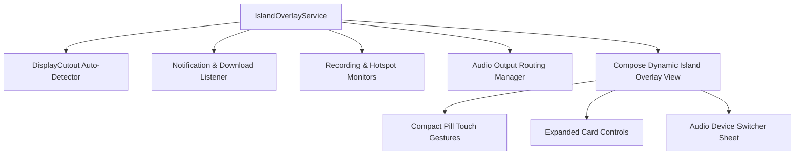

# Implementation Plan: 6 Next-Phase Power Enhancements for MyIsland

This comprehensive plan covers the implementation of all 6 recommended features to transform **MyIsland** into a fully autonomous, gesture-rich, and productivity-packed Dynamic Island experience.

---

## Proposed Features & System Architecture

---

## Detailed Implementation Breakdown

### 1. 🤖 Automatic Display Cutout Detection (Zero Calibration)
- **Goal**: Query native `DisplayCutout` bounding rect (`WindowInsets.displayCutout`) to auto-calculate top cutout offset (`yOffsetDp`) and safe width (`compactWidthDp`).
- **Files Affected**:
  - `[NEW] CutoutDetector.kt`: Helper to extract `DisplayCutout` top inset, bounds, and radius.
  - `[MODIFY] IslandModels.kt`: Add `isAutoCutoutDetectionEnabled: Boolean = false` to `IslandConfig`.
  - `[MODIFY] PreferencesManager.kt`: Save & load `isAutoCutoutDetectionEnabled`.
  - `[MODIFY] IslandOverlayService.kt`: Apply auto-calculated bounds to `layoutParams` when enabled.
  - `[MODIFY] SettingsScreens.kt`: Add "Auto-Detect Cutout" toggle switch in Cutout Calibration section.

---

### 2. 📁 Live Download & File Transfer Progress Bar
- **Goal**: Intercept ongoing download notifications (`Notification.CATEGORY_PROGRESS`, `EXTRA_PROGRESS`) from System DownloadManager, Chrome, Telegram, etc.
- **Files Affected**:
  - `[MODIFY] IslandModels.kt`: Add `DownloadState(isDownloading: Boolean, fileName: String, progressPercent: Int, bytesPerSec: Long, appName: String)`.
  - `[MODIFY] IslandNotificationListenerService.kt`: Extract progress extras (`EXTRA_PROGRESS`, `EXTRA_PROGRESS_MAX`) and update `downloadState` `StateFlow`.
  - `[MODIFY] CompactPillContent.kt`: Render mini download icon with animated progress ring/text (`45%`).
  - `[MODIFY] ExpandedCardContent.kt`: Show download filename, live progress bar, speed (`2.4 MB/s`), and Cancel action.

---

### 3. 🎙️ Voice Recorder & Screen Recording Pill
- **Goal**: Display active recording pill with a pulsing red recording dot, live timer (`01:42`), and quick controls.
- **Files Affected**:
  - `[MODIFY] IslandModels.kt`: Add `RecordingState(isRecording: Boolean, type: String, durationSeconds: Int, isPaused: Boolean)`.
  - `[MODIFY] IslandNotificationListenerService.kt`: Detect system screen recorder (`com.android.systemui.screenrecord`) and voice recorder notifications.
  - `[MODIFY] CompactPillContent.kt`: Render red pulsing dot and timer counter.
  - `[MODIFY] ExpandedCardContent.kt`: Render Pause, Resume, and Stop Recording action buttons.

---

### 4. 🎛️ Touch Gesture Control on Compact Pill
- **Goal**: Support rich touch gestures directly on the compact island container:
  - **Swipe Left / Right**: Skip to Next / Previous track during media playback.
  - **Horizontal Drag & Hold**: Live volume or track seek adjustment with tactile haptics.
  - **Double Tap**: Quick Play/Pause or dismiss notification.
  - **Single Tap**: Expand island card.
- **Files Affected**:
  - `[MODIFY] DynamicIslandView.kt`: Add `pointerInput` gesture detectors (`detectHorizontalDragGestures`, `detectTapGestures`) with haptic feedback.

---

### 5. 🌐 Active Personal Hotspot & Data Speed Monitor Banner
- **Goal**: Detect active Mobile Hotspot / Wi-Fi Tethering, displaying connected client count, live throughput speed, and a quick toggle button.
- **Files Affected**:
  - `[NEW] HotspotStateReceiver.kt`: BroadcastReceiver for `WIFI_AP_STATE_CHANGED_ACTION` and client count monitoring.
  - `[MODIFY] IslandModels.kt`: Add `HotspotState(isActive: Boolean, clientCount: Int, speedKbps: Long)`.
  - `[MODIFY] CompactPillContent.kt`: Display Hotspot icon with connected clients badge (`2 Clients`).
  - `[MODIFY] ExpandedCardContent.kt`: Render client list details and 1-tap Hotspot toggle button.

---

### 6. 🔊 In-Island Audio Output Device Switcher
- **Goal**: Native inline bottom sheet / popup list to seamlessly switch audio output routing between Phone Speaker, Bluetooth Headphones, and External Audio.
- **Files Affected**:
  - `[NEW] AudioOutputManager.kt`: Wrapper around `AudioManager` (`AudioDeviceInfo`, `communicationDevice`, `setSpeakerphoneOn`).
  - `[MODIFY] ExpandedCardContent.kt` & `DynamicIslandView.kt`: Render inline Audio Output picker modal with device icons (Headphones, Speaker, Bluetooth).

---

## User Review Required

> [!IMPORTANT]
> All 6 features are designed to integrate modularly into existing service flows without increasing battery consumption.
> Auto Cutout Detection provides instant zero-calibration alignment, while Touch Gestures add fluid iOS-style control.

---

## Verification Plan

### Automated Tests / Build Verification
- Compile and verify with `./gradlew assembleDebug` (or `gradlew.bat assembleDebug`).

### Manual Verification
- Test Auto Cutout Detection toggle in Settings.
- Test active download progress, screen recording timer, hotspot status banner, and audio output routing switcher.
- Test swipe left/right gestures on compact pill for track navigation.
